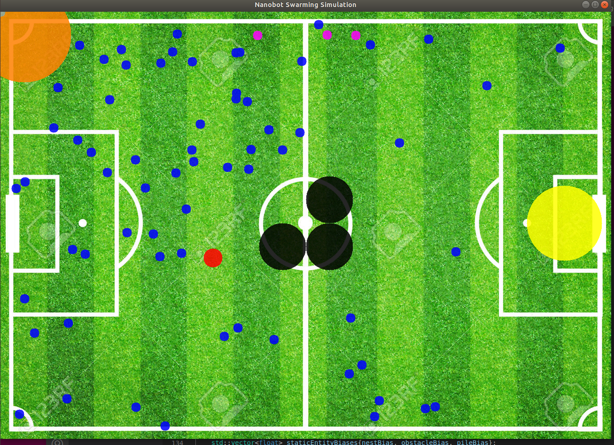
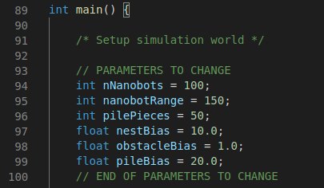
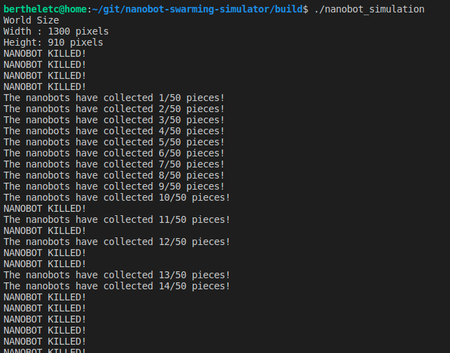
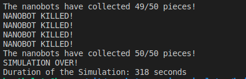

# CPPND: Nanobot Swarming Simulator

This is my submission for the Capstone project in the [Udacity C++ Nanodegree Program](https://www.udacity.com/course/c-plus-plus-nanodegree--nd213).

This project is a simulator, in which the objective is for nanobots to find the pile, retrieve pieces, and return them to the nest as quickly as possible and without getting killed. This project builds off of alot of code from the Concurrent-Traffic-Simulator (multithreading, graphics, etc.)

There are many entities that exist in the nanobot world including the following:
* **Nest**: the place the nanobot comes and goes from. The nanobot will leave from the nest, find pieces, and bring them back to the nest
* **Obstacle**: the enthities that the object must avoid and go around to get to the pieces
* **Pile**: the place where all the pieces are kept. The nanobot must find the pile, take a piece, and bring it back
* **Predators**: these entities move around randomly and kill nanobots as they are trying to do their job

The nanobots move based on a 3x3 probability matrix of the common directions (NW, N, NE, W, CURRENT POSITION, E, SW, S, SE). These probability matrices can be biased if the nanobot sees another entity. Piles and Nests attract the nanobots, while Obstacles repel them. Predators on the other hand straight up kill the nanobots.

The simulation time changes based on the input parameters. These parameters can be customized (see below).

**HAVE FUN!!!!! :)**

## File Structure

* ALL **.h** files are located in the **inc** directory
* ALL **.cpp** are located in the **src** directory
* Images for the simulator and the README can be found in the **images** directory

## Class Structure

* The **simulator.cpp** file contains the main function for this project and is not itself a class
* ALL other files are classes

**Class Descriptions:**

* The **Graphics** class is a standalone class, whose purpose is to render the visualization (similar code to concurrent traffic simulator)

* The **Entity** class is an abstract parent class, whose purpose is to give all world entities common traits (positions, colors, etc.)

* The **Static** class is an abstract parent class, whose purpose is to give all static entities a bias and visual state

* The **Dynamic** class is an abstract parent class, whose purpose is to give all dynamic entities the ability to move randomly based on a probability matrix

* The **Nest** class inherits from the **Static** and **Entity** classes, and its purpose is to, be the starting position for and store collected pieces from nanobots

* The **Obstacle** class inherits from the **Static** and **Entity** classes, and its purpose is to serve as an entity that nanobots must avoid and move around

* The **Pile** class inherits from the **Static** and **Entity** classes, and its purpose is to hold the pieces that the nanobot must retrieve

* The **Predator** class inherits from the **Dynamic** and **Entity** classes, and its purpose is to randomly move around and kill nanobots

* The **Nanobot** class inherits from the **Dynamic** and **Entity** classes, and its purpose is to collect pieces from a pile and bring them back to the nest

## Dependencies for Running Locally
* cmake >= 3.11.3
  * All OSes: [click here for installation instructions](https://cmake.org/install/)
* make >= 4.1 (Linux, Mac), 3.81 (Windows)
  * Linux: make is installed by default on most Linux distros
  * Mac: [install Xcode command line tools to get make](https://developer.apple.com/xcode/features/)
  * Windows: [Click here for installation instructions](http://gnuwin32.sourceforge.net/packages/make.htm)
* OpenCV >= 4.1
  * The OpenCV 4.1.0 source code can be found [here](https://github.com/opencv/opencv/tree/4.1.0)
* gcc/g++ >= 5.4
  * Linux: gcc / g++ is installed by default on most Linux distros
  * Mac: same deal as make - [install Xcode command line tools](https://developer.apple.com/xcode/features/)
  * Windows: recommend using [MinGW](http://www.mingw.org/)

## Basic Build Instructions

1. Clone this repo.
2. Make a build directory in the top level directory: `mkdir build && cd build`
3. Compile: `cmake .. && make`
4. Run it: `./nanobot_simulation`.

## Simulation Parameters

* If you would like to play with some simulation parameters PLEASE ONLY CHANGE THE ONES LISTED BELOW

* nNanobots: changes the number of nanobots (dont go more than 200, each nanobot is a thread)
* nanobotRange: the range within in pixels that a nanobot can identify a seen entity (obstacle, pile)
* pilePieces: how many pieces the nanobots must retrieve for the simulation to complete
* nestBias: amount of bias given to nanobot probability matrix if nest seen (attracting)
* obstacleBias: amount of bias given to nanobot probability matrix if obstacle seen (repelling)
* pileBias: amount of bias given to nanobot probability matrix if pile seen (attracting)

## Running Behavior

* While the simulation is running you will see a window like the one shown in the project intro above.
* The color coding key is as follows
  * Nanobots: purple, blue, or pink
    * purple - in the nest
    * blue - searching for the pile of pieces
    * pink - returning to nest with piece
  * Predators: red
  * Nests: orange
  * Obstacles: black
  * Piles: yellow
* While the simulation is running you will see printouts of what is happening as shown in the image below.
* You will see the following things printed out to the console.
    * Message when nanobot returns a piece to the nest telling how many have been collected.
    * Message stating that a nanobot has been killed by a predator. 

* Once the simulation is complete you will see console printouts stating the completion as well as the simulation duration (as shown below)

## Rubric Checkoffs

THE FOLLOWING RUBRIC POINTS ARE ADDRESSED IN THIS PROJECT

* The project demonstrates an understanding of C++ functions and control structures.
  * FILES: Check ALL files
* The project reads data from a file and process the data, or the program writes data to a file. 
  * FILES: Check graphics.cpp, line 46 
* The project uses Object Oriented Programming techniques.
  * FILES: Check entire project structure and files except simulator.cpp
* Classes use appropriate access specifiers for class members.
  * FILES: Check ALL .h files
* Classes abstract implementation details from their interfaces.
  * FILES: Check entire project structure and files except simulator.cpp
* Classes encapsulate behavior.
  * FILES: Check entire project structure and files except simulator.cpp
* Classes follow an appropriate inheritance hierarchy.
  * FILES: Check entire project structure and files except simulator.cpp. Specifically look at Nanobot, Predator, Nest, Obstacle, and Pile subclasses
* Derived class functions override virtual base class functions.
  * FILES: Check out Predator and Nanobot classes that overrite virtual methods from Entity and Dynamic classes
* The project makes use of references in function declarations.
  * FILES: Check out nanobot.cpp, lines 213, 266, 358
* The project uses destructors appropriately.
  * FILES: Check out entity.cpp, line 24
* The project uses smart pointers instead of raw pointers.
  * FILES: Shared pointers are used to pass the entity objects around. Check out simulator.cpp, line 106
* The project uses multithreading.
  * FILES: Nanobots and Predators run in threads. Check out nanobot.cpp and predator.cpp
* A mutex or lock is used in the project.
  * FILES: Check out nanobot.cpp, lines 92, 230, 268, 283, 401, 423

